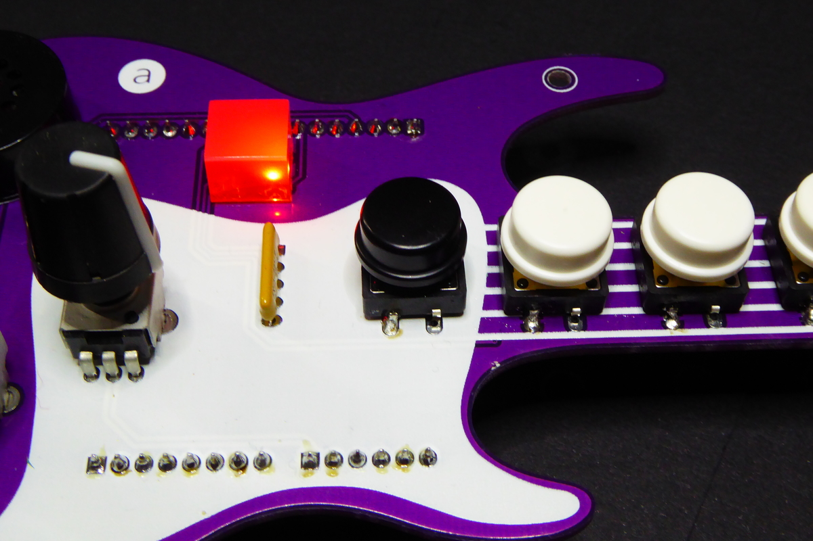
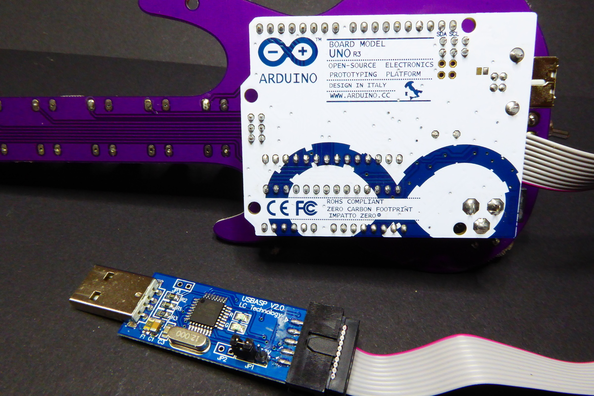

# Fenderino Arducaster MIDI

Code example to provide MIDI support to the Fenderino Arducaster Arduino Shield.
This code should work out of the box with Arduino Leonardo boards and Arduino UNO
boards flashing [HIDUINO][1] into the atmega16u2 (atmega8u2 for older boards).

## Features

This code lets you play a full scale with the shield buttons.
The potentiometer allows you to raise or lower the pitch note by note.
When the first button (the black one) matches a C (DO) the four LEDs flash.
The buttons then match a full octave.

With the switch down the output goes to the built in buzzer or the 3.5mm jack.
Moving the switch up the output goes to the USB interface as MIDI commands instead. The behaviour is the same as before plus you have polyphony, you can play more
than one note at a time.

## Installing

### Arduino Leonardo (easy)

The sketch uses the [MIDIUSB][2] library by Gary Grewal & Arduino to manage the notes in a Leonardo, which is HID ready.

If you are using the Arduino IDE the MIDIUSB library is available in the library manager. f you are using PlatformIO the provided project file already defines the dependencies so it will install it automatically for you.

### Arduino Uno (harder)

The sketch uses the [MIDI Library][3] library by FortySevenEffects to manage the notes in the Uno.

You will need to flash [HIDUINO][1] in the ATMega8u2 or ATMega16u2 controller to support MIDI over USB. This is the controller responsible for the communications between the ATMega328p and your computer so you will loose that (no Serial, no flashing over USB).

To modify the firmware on that micro and to flash the main micro in the Uno faterwards, you will need an AVR programmer.

To flash the firmware set the switch to the center position.

## Using it

Once loaded the code here (and HIDUINO if using a Uno) connect your board with the Fenderino Arducaster on top to a MIDI client and select "arduino_midi:0" (Uno) or "Arduino Leonardo:0" (Leonardo) as input.

Move the switch up and have fun!

## License

The code is based on examples provided by abierto.cc so the license derives from theirs.

(c) 2017 D. Cuartielles para Abierto.cc

(c) 2017 Xose Pérez (MIDI & Leonardo support)

[1]: https://github.com/ddiakopoulos/hiduino
[2]: https://github.com/arduino-libraries/MIDIUSB
[3]: https://github.com/FortySevenEffects/arduino_midi_library
